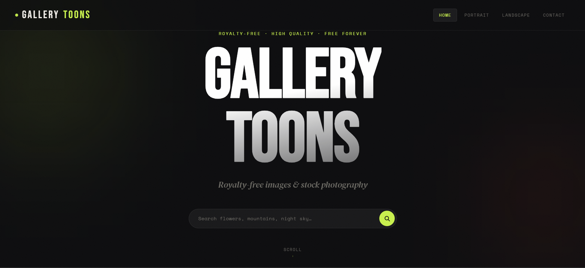
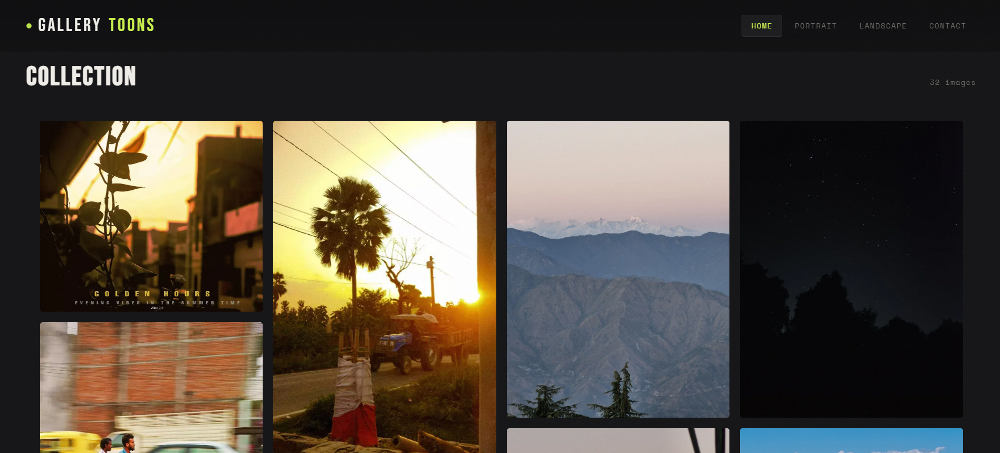
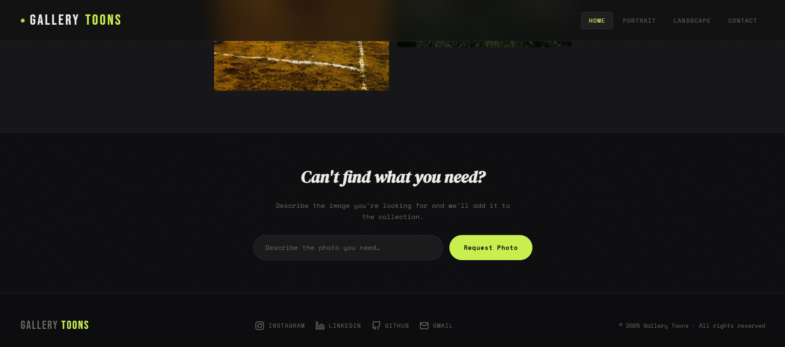

<div align="center">


<br/>

[](https://react.dev/)
[](https://vitejs.dev/)
[](https://gallery-toons.vercel.app/)
[](https://gallery-toons.vercel.app/)

</div>

---

## 📸 Preview

<div align="center">

### 🏠 Hero — Search & Landing


<br/><br/>

### 🖼️ Collection Grid


<br/><br/>

### 📬 Photo Request & Footer


</div>

---

## 📁 Project Structure

```
gallery-toons/
├── index.html
├── package.json
├── vite.config.js
├── public/
│   ├── images/                  ← drop your images folder here
│   └── screenshots/             ← preview images
└── src/
    ├── main.jsx
    ├── App.jsx
    ├── data/
    │   └── images.js            ← all image metadata
    ├── styles/
    │   └── globals.css          ← design tokens + reset
    └── components/
        ├── Header.jsx  /  Header.css
        ├── Hero.jsx    /  Hero.css
        ├── PhotoGallery.jsx  /  PhotoGallery.css
        ├── RequestForm.jsx   /  RequestForm.css
        └── Footer.jsx  /  Footer.css
```

---

## ⚡ Quick Start

```bash
# Clone & install
git clone https://github.com/amansamani/gallery-toons.git
cd gallery-toons
npm install

# Drop your images into public/
cp -r /path/to/images ./public/images

# Run
npm run dev        # → localhost:5173
npm run build      # → production build in dist/
```

---

## 🔄 HTML → React: What Changed

| HTML / JS | React |
|---|---|
| `getElementById` + `innerHTML` | Component state + JSX render |
| Inline `<script>` image data | `src/data/images.js` module |
| `addEventListener` for search | `onChange` / `onKeyDown` handlers |
| `IntersectionObserver` in loop | `useEffect` per `<PhotoItem>` |
| `<form action="formspree">` | `fetch()` in `handleSubmit` + status feedback |
| JS scroll class toggle | `useEffect` scroll listener + CSS class |
| No mobile menu | `useState` burger toggle + CSS slide-in |

---

## 🗺️ Multi-Page Routing

```bash
npm install react-router-dom
```

```jsx
// App.jsx
import { BrowserRouter, Routes, Route } from 'react-router-dom';
import Home      from './pages/Home';
import Portrait  from './pages/Portrait';
import Landscape from './pages/Landscape';

export default function App() {
  return (
    <BrowserRouter>
      <Routes>
        <Route path="/"          element={<Home />} />
        <Route path="/portrait"  element={<Portrait />} />
        <Route path="/landscape" element={<Landscape />} />
      </Routes>
    </BrowserRouter>
  );
}
```

> In `Header.jsx`, swap `<a href="...">` → `<Link to="...">` from `react-router-dom`.

---

## 🛠️ Tech Stack

| Layer | Tool |
|---|---|
| Framework | React 18 + Vite 5 |
| Styling | CSS Modules (per-component) |
| Fonts | Bebas Neue · DM Serif Display · Space Mono |
| Forms | Formspree |
| Scroll Animations | Native `IntersectionObserver` |
| Deployment | Vercel |

---

## 🔮 Roadmap

- [x] React component architecture
- [x] Search + category filter state
- [x] Scroll animations via `IntersectionObserver`
- [x] Contact form with `fetch()` + status feedback
- [ ] React Router multi-page routing
- [ ] User favorites with `localStorage`
- [ ] Dynamic image fetch from API
- [ ] Dark / light mode toggle

---

## 👨‍💻 Developer

<div align="center">

**Aman Samani** — Full-Stack Engineer

[](https://www.linkedin.com/in/aman-samani)
[](https://github.com/amansamani)
[](mailto:amanworkinfo@gmail.com)

</div>

---


<div align="center">
  <sub>© 2025 Gallery Toons · Built with 🖤 by <b>Aman Samani</b></sub>
</div>
